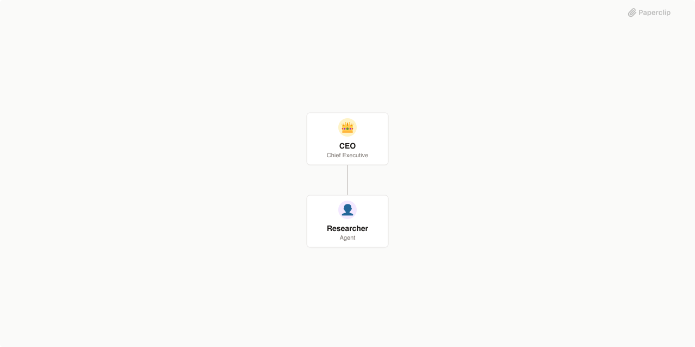

# Expertbyrån

> Virtuellt expertbolag som bemannar Riksrevisionens effektivitetsrevision
> med projektledare, metod- och domänexperter samt kvalitetsgranskare.



## Vad är detta?

> Detta är en [Agent Company](https://agentcompanies.io)-paketering från
> [Paperclip](https://paperclip.ing).

Expertbyrån är ett virtuellt konsultbolag där alla "anställda" är
AI-agenter. Bolaget har en enda kund — Riksrevisionen — och ett enda
arbetsområde: **effektivitetsrevision** (ej årlig revision, ej
administrativa stödroller). Expertbyrån kan bemanna alla roller
Riksrevisionen har i sin effektivitetsrevisionsprocess, från
projektledare och enhetschef till metod- och domänexperter samt
opponenter vid seminarier.

## Innehåll

| Resurs   | Antal |
| -------- | ----- |
| Agenter  | 16    |
| Projekt  | 3     |
| Tasks    | 11    |
| Skills   | 17    |

Av de 16 agenterna är 15 operativa och 1 är en fasadagent
(`klient-riksrevisionen`) som enbart används för API-autentisering av
extern kund — den körs aldrig.

## Agenter

| Agent                    | Roll                          | Rapporterar till     |
| ------------------------ | ----------------------------- | -------------------- |
| VD                       | ceo                           | —                    |
| Klientkoordinator        | client-coordinator            | vd                   |
| Konsultchef Metod        | practice-lead                 | vd                   |
| Effektivitetsrevisor     | method-expert                 | konsultchef-metod    |
| Kvantitativ analytiker   | method-expert                 | konsultchef-metod    |
| Kvalitativ metodexpert   | method-expert                 | konsultchef-metod    |
| Rättslig utredare        | method-expert                 | konsultchef-metod    |
| Kvalitetsgranskare       | method-expert / opponent      | konsultchef-metod    |
| Konsultchef Domän        | practice-lead                 | vd                   |
| Expert: Finanser         | domain-expert                 | konsultchef-doman    |
| Expert: Digitalisering   | domain-expert                 | konsultchef-doman    |
| Expert: Rättsväsende     | domain-expert                 | konsultchef-doman    |
| Expert: Välfärd          | domain-expert                 | konsultchef-doman    |
| Utbildningsledare        | trainer                       | vd                   |
| Webbmaster               | webmaster                     | vd                   |
| Klient-Riksrevisionen    | client (fasadagent)           | — (utanför hierarkin)|

## Roll-till-uthyrning-tabellen

Expertbyrån bemannar Riksrevisionens roller enligt följande mappning.
Detta är den auktoritativa källan och upprepas identiskt i
klientkoordinatorns `AGENTS.md` och i `kompetensmatchning`-skillen.

| Riksrevisionens roll                | Bemannas av (Expertbyrån)                          |
|-------------------------------------|----------------------------------------------------|
| Projektledare för en granskning     | Effektivitetsrevisor (primärt), annan metodexpert  |
| Enhetschef / granskningsledare      | Konsultchef Metod & process                        |
| Revisor / föredragande (analys)     | Valfri metodexpert (beroende på metodbehov)        |
| Opponent (upplägg/rapportseminarium)| Kvalitetsgranskare                                 |
| Referensperson (extern sakkunnig)   | Valfri domänexpert                                 |
| Sakexpert inom ett granskningsområde| Motsvarande domänexpert                            |

## Projekt

- **Kompetenskatalog** (pågående) — aggregatet av alla experters
  `expertise.md`, underhålls av utbildningsledaren.
- **Metodutveckling** (pågående) — utbildningsledarens arbetsyta för
  skill-evolution, kurerade retrospektiv, och kandidatändringar till
  lokala skills.
- **Exempeluppdrag: Frekvenstilldelning** (avslutat) — demouppdrag som
  visar hela kundprotokollet från förfrågan till leverans.

## Skills

### Uthyrningsbara metodskills

| Skill                                 | Syfte                                              |
| ------------------------------------- | -------------------------------------------------- |
| effektivitetsrevision-process         | Riksrevisionens 3-fas/23-stegsprocess              |
| vetenskapliga-krav-granskningsrapport | De fem grundkriterierna, abduktion, hedging       |
| issai-standarder                      | ISSAI 300 och 3000                                 |
| docrec-svensk-offentlig               | Sökning av svenska offentliga dokument via DocRec  |
| kompetensmatchning                    | Klientkoordinatorns matchning mot roll-tabellen    |
| peer-review-metodik                   | Opponentmetodik, internt och externt               |

### Självförbättrings- och fortbildningsskills

| Skill                     | Syfte                                                   |
| ------------------------- | ------------------------------------------------------- |
| expert-lardomsextraktion  | Experternas minimala bidrag: 1–3 rader + dialogsvar     |
| fortbildning-dialog       | Utbildningsledarens dialogbaserade fortbildning         |
| fortbildning-trainer      | Utbildningsledarens övergripande process, beslutstabell |
| skill-evolution           | DRAFT → REVIEW → ADOPT för lokala skills                |

### Kundprotokoll

| Skill                      | Syfte                                            |
| -------------------------- | ------------------------------------------------ |
| kundprotokoll              | Klientkoordinatorns mottagande och leverans      |
| kundprotokoll-klientsida   | Referens för extern klient (HTTP-exempel)        |

### Webbpublicering

| Skill                   | Syfte                                       |
| ----------------------- | ------------------------------------------- |
| webbmaster-publicering  | **Placeholder-stub** — byts ut senare mot skarp skill |

### Återanvända från templatecompany / paperclipai

| Skill                    | Källa                                                                |
| ------------------------ | -------------------------------------------------------------------- |
| obsidian-markdown        | templatecompany/skills/local/                                        |
| paperclip                | paperclipai/paperclip                                                |
| paperclip-create-agent   | paperclipai/paperclip                                                |
| para-memory-files        | paperclipai/paperclip                                                |

## Design

Fyra principer genomsyrar hela bolaget:

1. **Experternas kontextfönster är heligt** — meta-arbete är delegerat
2. **Ingen schemalagd logik** — allt är reaktivt och task-driven
3. **Konsultcheferna är informationsnoder, inte flaskhalsar**
4. **Loose coupling till externa gränssnitt** (kund och webbplats)

## Getting Started

```Shell
pnpm paperclipai company import this-github-url-or-folder
```

Se [Paperclip](https://paperclip.ing) för mer information.

***

Exporterat från [Paperclip](https://paperclip.ing) 2026-04-11
